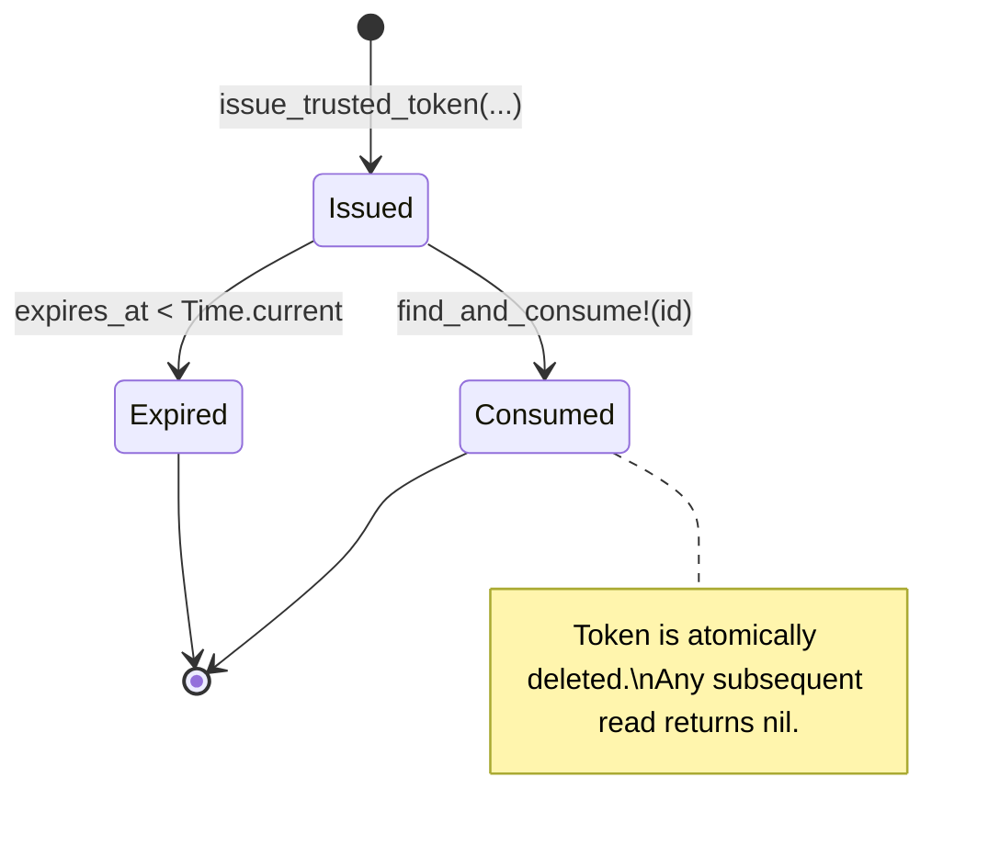

# Trusted Export Tokens

Trusted export tokens are single-use, time-limited tokens that allow a server-side
issuer (ActiveJob, admin panel, sidecar) to grant a one-off export to an external
system **without** passing the actor, context recording, or export key over the
wire.

---

## Overview

| Pattern | When to use |
|---|---|
| Standard export (`RecordingStudioExportable.export`) | The user is authenticated and making a direct request from the UI. |
| Trusted token export (`export_from_token`) | A server-side job or admin panel pre-resolves the rows and hands a one-time link to another system. |

Benefits:

- **Decoupled row resolution** — rows are resolved at issue time, not request time.
- **No credential leakage** — `context_recording_id`, actor, and export key never leave the issuer.
- **Single-use guarantee** — atomic read-and-delete prevents replay.
- **Time-bounded** — tokens expire after a configurable TTL (default 5 minutes).

---

## Quick Start

### 1. Configure allowed sources

```ruby
# config/initializers/recording_studio_exportable.rb
RecordingStudioExportable.configure do |config|
  config.trusted_export_sources = %w[RecordingStudioAdmin]
end
```

### 2. Issue a token

```ruby
token = RecordingStudioExportable.issue_trusted_token(
  context_recording: recording,
  actor: Current.actor,
  source: "RecordingStudioAdmin",
  screen_identifier: "Admin Users Export",
  columns: [
    { key: :title,      label: "Title",  value: :title },
    { key: :word_count, label: "Words",  value: ->(article) { article.body.to_s.split.size } }
  ],
  row_resolver: -> { Article.order(:title).to_a },
  ttl: 30.seconds
)

# Pass token.id to the external system
export_url = recording_studio_exportable.exports_url(export_token: token.id)
```

### 3. Consume the token

```bash
curl -X POST https://example.com/recording_studio_exportable/exports \
  -d "export_token=TOKEN_ID&format=csv"
```

That is it. The external system needs **only** the token ID.

---

## Configuration

### `trusted_export_sources`

An array of string identifiers. Only sources in this list can issue tokens.

```ruby
config.trusted_export_sources = %w[RecordingStudioAdmin MySidecarApp]
```

If a source not in this list attempts to issue a token, `TrustedExportToken::Error`
is raised.

### `trusted_export_token_store` (optional)

By default the engine uses an in-memory store (`TrustedExportTokenStore`).
For production deployments that span multiple processes, provide a custom store:

```ruby
config.trusted_export_token_store = MyRedisTokenStore.new
```

The store must implement two methods:

```ruby
# Persist a token with an optional TTL in seconds.
def write(key, value, expires_in:)
end

# Atomically read AND delete. Return nil if the key does not exist.
def consume(key)
end
```

The atomicity of `consume` is critical — it prevents a token from being used
more than once under concurrent requests.

---

## API Reference

### `RecordingStudioExportable.issue_trusted_token`

Issues a single-use trusted export token.

```ruby
RecordingStudioExportable.issue_trusted_token(
  context_recording:,  # RecordingStudio::Recording — the export context
  actor:,              # Object — the user/actor on whose behalf the export runs
  source:,             # String — must be in trusted_export_sources
  screen_identifier:,  # String — human-readable label for the export screen
  columns:,            # Array<Hash|ExportDefinition::Column> — column definitions
  row_resolver:,       # Callable — proc/lambda that returns rows when invoked
  ttl: 5.minutes       # ActiveSupport::Duration — capped at 5 minutes (optional)
)
```

Returns a `TrustedExportToken` instance with:

| Attribute | Description |
|---|---|
| `id` | Opaque token identifier (URL-safe base64). Pass this to the consumer. |
| `effective_export_key` | Derived as `source.screen_identifier` (normalised). |
| `expires_at` | `Time` when the token becomes invalid. |
| `source` | The issuer source string. |
| `screen_identifier` | The human-readable label provided at issue time. |

### `RecordingStudioExportable.export_from_token`

Consumes a token and streams the export.

```ruby
RecordingStudioExportable.export_from_token(
  token_id:,   # String — the token.id from issue_trusted_token
  format: :csv,             # Symbol — output format (optional, default :csv)
  filename: nil,            # String — override filename (optional)
  filters: {},              # Hash — filter values (optional)
  controller: nil           # ActionController::Base — current controller (optional)
)
```

Returns an `Exporter::Result` with `data`, `filename`, and `content_type`.

### `TrustedExportToken.find_and_consume!`

Low-level method that the engine controller uses internally:

```ruby
token = TrustedExportToken.find_and_consume!(token_id)
```

Raises:

- `TrustedExportToken::TokenNotFound` — token was already consumed or never existed.
- `TrustedExportToken::TokenExpired` — token's `expires_at` is in the past.

---

## Token Lifecycle



| Behaviour | Detail |
|---|---|
| **Single-use** | `find_and_consume!` atomically reads and deletes. A token can never be used twice. |
| **Time-limited** | Default TTL is 5 minutes. The `ttl` argument is **capped** at 5 minutes. |
| **Expired** | Raises `TokenExpired` → HTTP 410 Gone in the engine controller. |
| **Missing / consumed** | Raises `TokenNotFound` → HTTP 404 Not Found in the engine controller. |
| **Unauthorised source** | `issue_trusted_token` raises `TrustedExportToken::Error` immediately. |

---

## Controller Integration

The engine's `ExportsController` auto-detects the token path. When
`params[:export_token]` is present it delegates to `export_from_token` instead of
the standard `export` flow:

```ruby
# app/controllers/recording_studio_exportable/exports_controller.rb
def create
  result = if params[:export_token].present?
              RecordingStudioExportable.export_from_token(
                token_id: params[:export_token],
                format: permitted_export_params[:format] || RecordingStudioExportable.configuration.default_format,
                filename: permitted_export_params[:filename],
                filters: permitted_export_params[:filters] || {},
                controller: self
              )
            else
              RecordingStudioExportable.export(...)
            end

  send_data result.data, filename: result.filename, type: result.content_type, disposition: "attachment"
end
```

Error handling is automatic:

| Exception | HTTP Status | View |
|---|---|---|
| `TrustedExportToken::TokenNotFound` | 404 Not Found | `token_not_found.html.erb` |
| `TrustedExportToken::TokenExpired` | 410 Gone | `token_expired.html.erb` |
| Other `RecordingStudioExportable::Error` | 400 Bad Request | Plain text |

Custom error views are shipped with the engine and can be overridden by placing
matching files in the host app's `app/views/recording_studio_exportable/exports/`
directory.

---

## When NOT to Use Trusted Tokens

Trusted tokens are **not** a replacement for the standard `export` API when:

- The user is authenticated and making a direct UI request — use `export` instead.
- You need column/attribute negotiation from the export definition.
- You want the export key to control allowed columns and formats via the definition.
- The consumer should be able to re-run the export with different parameters.

Use the standard flow for interactive exports and the token flow for
server-to-server or deferred export orchestration.

---

## Where to See It in Action

The dummy app shipped with this engine includes:

- **Live docs page** — `test/dummy/app/views/docs/trusted_exports.html.erb`
  (accessible at `/docs/trusted_exports` in the dummy app).
- **Home page demo** — `test/dummy/app/views/home/index.html.erb` includes an
  interactive trusted-token export demo.
- **Integration tests** — `test/exports_controller_test.rb` and
  `test/trusted_export_token_test.rb` cover the full lifecycle.
- **Example initializer** — `test/dummy/config/initializers/recording_studio_exportable.rb`
  shows `trusted_export_sources` configuration.