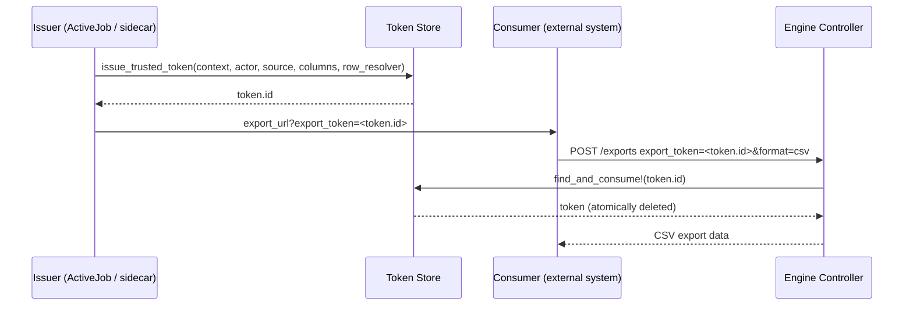

# RecordingStudioExportable API Cheat Sheet

This note explains the two main APIs used in the dummy app configuration:

- `config.register_export(...)`
- `RecordingStudio::Exportable::Capabilities::Exportable.enabled(...)`

It also explains how `context_recording`, `context_types`, and `required_role` fit into the access model.

In the current convention, export definitions live in `app/services/exports/**/*_export.rb` and the initializer calls `RecordingStudioExportable.auto_register_exports!(config)`.

## 1. `config.register_export(...)`

This defines one export.

Think of it as:

- the export key that exists in the system
- the metadata for that export
- the resolver block that returns the rows

Example export class:

```ruby
class RecordingStudioDemoDashboardRequestsExport
  def self.register(config)
    config.register_export(
      "recording_studio_demo_dashboard_requests_export",
      label: "Demo API requests",
      description: "Exports the API request rows shown on the demo dashboard.",
      context_types: ["DemoDashboard"],
      columns: [
        { key: :path, label: "Path", value: :path },
        { key: :method, label: "Method", value: :http_method },
        { key: :status, label: "Status", value: :status },
        { key: :duration_ms, label: "Duration (ms)", value: :duration_ms }
      ],
      filename: ->(context_recording:, **) { "#{context_recording.recordable.name}-api-requests.csv" }
    ) do |context_recording:, filters:, **|
      scope = context_recording.recordable.demo_api_requests.order(:created_at)
      scope = scope.where(status: filters[:status]) if filters[:status].present?
      scope
    end
  end
end
```

Example initializer:

```ruby
RecordingStudioExportable.configure do |config|
  config.current_actor = ->(controller: nil) { controller&.send(:current_user) || Current.actor }
  RecordingStudioExportable.auto_register_exports!(config)
end
```

### What can be passed to `register_export`

The method shape is:

```ruby
register_export(key, replace: false, **options, &block)
```

#### Required

- `key` - the unique export key

#### Optional

- `replace:` - when `true`, replace an existing definition with the same key
- `label:` - human-friendly name
- `description:` - human-friendly description
- `context_types:` - allowed context recordable types
- `context_key:` or `context_keys:` - optional extra screen/section restriction inside the context
- `columns:` - all allowed columns for the export
- `default_columns:` - columns used when none are requested
- `filename:` - static string or callable that returns a filename
- `required_role:` - role checked through RecordingStudio Accessible
- `max_rows:` - row limit for the export
- `formats:` - allowed output formats
- `resolver:` - explicit resolver callable
- `context_predicate:` - optional custom context check

#### Block parameters

The export block can receive:

- `context_recording:`
- `actor:`
- `attributes:`
- `filters:`
- `format:`
- `controller:`

High-level meaning:

- `context_recording:` - the current RecordingStudio context the export runs from
- `actor:` - the current user/actor running the export
- `attributes:` - requested export attributes (for example selected columns)
- `filters:` - filter values from the request (for example status/date filters)
- `format:` - requested output format (v1 is CSV)
- `controller:` - current controller instance when available

Example:

```ruby
do |context_recording:, actor:, attributes:, filters:, format:, controller:|
  # return rows here
end
```

Example with real usage:

```ruby
config.register_export(
  "recording_studio_demo_dashboard_requests_export",
  context_types: ["DemoDashboard"],
  columns: [
    { key: :path, label: "Path", value: :path },
    { key: :status, label: "Status", value: :status }
  ]
) do |context_recording:, actor:, attributes:, filters:, format:, controller:|
  # 1) Start from the current export context
  scope = context_recording.recordable.demo_api_requests.order(:created_at)

  # 2) Apply incoming filters
  scope = scope.where(status: filters[:status]) if filters[:status].present?

  # 3) Optional actor-aware filtering
  scope = scope.where(private: false) unless actor&.respond_to?(:admin?) && actor.admin?

  # 4) You can inspect attributes/format/controller if needed
  requested = attributes.is_a?(Hash) ? attributes[:columns] || attributes["columns"] : attributes
  Rails.logger.debug("export columns=#{requested.inspect} format=#{format} controller=#{controller.class.name if controller}")

  scope
end
```

### What `register_export` means in practice

This is the definition of a single export.

- It says the export key exists.
- It says which context types may use it.
- It says which columns are allowed.
- It says how to build the rows.

If you need two exports, you call `register_export` twice with two different keys.

## 2. `RecordingStudio::Exportable::Capabilities::Exportable.enabled(...)`

This enables export keys for a recordable type.

Think of it as:

- the allowlist for a recordable type
- the second lock after the export is defined globally

Example:

```ruby
class DemoDashboard < ApplicationRecord
  recording_studio_recordable label: "Demo Dashboard", root: true

  RecordingStudio::Exportable::Capabilities::Exportable.enabled(
    export_keys: ["recording_studio_demo_dashboard_requests_export"]
  )
end
```

### What can be passed to `enabled`

The capability method is used like this:

```ruby
enabled(export_keys: [...], **options)
```

#### Required

- call `enabled(...)` from inside the recordable model class body so the recordable type can be inferred

#### Optional

- `export_keys:` - array of export keys allowed for that type
- `exports:` - alias for `export_keys`
- `required_role:` - role default for that type
- `max_rows:` - row limit default for that type
- `formats:` - allowed formats default for that type

### What this means

This does not define the export itself.

It only says which export keys are allowed on that context type.

If you want the same export on another context type, you need another `enabled(...)` call for that other type.

Example:

```ruby
class DemoDashboard < ApplicationRecord
  RecordingStudio::Exportable::Capabilities::Exportable.enabled(
    export_keys: ["recording_studio_demo_dashboard_requests_export"]
  )
end

class Workspace < ApplicationRecord
  RecordingStudio::Exportable::Capabilities::Exportable.enabled(
    export_keys: ["recording_studio_demo_dashboard_requests_export"]
  )
end
```

## 3. The two-lock model

An export must pass two gates:

1. It must be registered globally.
2. It must be allowed on the specific context type/instance.

That means:

- `register_export(...)` creates the export definition
- `enabled(...)` allows that definition on a particular recordable type

If either one is missing, the export should fail.

## 4. `context_recording`

`context_recording` is the export context object.

It is the anchor for:

- access control
- allowed export key lookup
- export log association
- RecordingStudio event logging

In simple terms, it tells the system:

> "Run this export from this exact screen/context."

### Why it is needed

The rows you export can come from any place:

- unrelated models
- joins
- SQL queries
- reports
- dashboards
- POROs
- arrays

But the permission check still happens against the context recording.

That means the system checks:

1. Is this export key allowed for this context?
2. Is the actor authorized for this context?
3. Is this definition valid for this context type?

## 5. `context_types`

`context_types` is the list of allowed recordable types for the export definition.

It is an array because one export can be valid for one type or for many types.

Examples:

```ruby
context_types: ["DemoDashboard"]
```

Only `DemoDashboard` can use it.

```ruby
context_types: ["Page", "Workspace", "AdminScreen"]
```

Any of those context types can use it.

### Important

`context_types` is about the allowed context, not the tables queried by the export.

You can query many tables in the resolver and still keep `context_types: ["DemoDashboard"]`.

## 6. `context_key` and `context_keys`

`context_key` and `context_keys` are optional extra restrictions for where an export can be used inside a context type.

Think of them as a narrower filter than `context_types`.

Examples:

```ruby
context_key: "requests_table"
```

```ruby
context_keys: ["requests_table", "overview_panel"]
```

### What they mean

- `context_key` = one specific screen/section key
- `context_keys` = multiple allowed screen/section keys

If you do not set either one, there is no extra screen/section restriction.

## 7. `required_role`

`required_role` is the role passed into RecordingStudio Accessible.

The access check is effectively:

```ruby
RecordingStudioAccessible.authorized?(
  actor: actor,
  recording: context_recording,
  role: required_role
)
```

### Role resolution order

The brief resolves the role in this order:

1. definition-level `required_role`
2. capability-level `required_role`
3. config default `default_required_role`
4. fallback `:view`

### Simple example

```ruby
config.register_export(
  "pages.with_articles",
  required_role: :admin
) do |context_recording:, **|
  # resolver
end
```

This means that specific export needs admin access unless something more specific is set elsewhere.

## 8. Why resolver scoping still matters

Passing the access check does not automatically make every joined row safe.

Example risk:

1. User can export from `Workspace A`.
2. Export is allowed on `Workspace A`.
3. Resolver joins `articles` without filtering by workspace.
4. Export can accidentally include rows from another workspace.

So the resolver should still be scoped carefully:

- anchor the query to the context
- apply visibility filters or policy scopes
- then return rows

## 9. Short version

- `register_export(...)` = define the export
- `enabled(...)` = allow that export key on a context type
- `context_recording` = the export boundary and permission anchor
- `context_types` = allowed context types, not table names
- `context_key` / `context_keys` = extra optional screen/section restriction inside the context
- `required_role` = the role checked through Accessible
- resolver query = still needs safe scoping for joined/unrelated tables

## Trusted Export Tokens

Trusted export tokens are single-use, time-limited tokens that allow a server-side
issuer to grant a one-off export to an external system *without* passing the
actor, context recording, or export key over the wire.

The flow is:

1. **Issue** a token server-side with the rows, columns, and context already resolved.
2. **Pass only the token ID** to the external consumer.
3. The consumer **POSTs the token ID** to the engine endpoint.
4. The engine **atomically consumes** the token (read-and-delete) and streams
   the export.



### Why use trusted tokens

| Pattern | When to use |
|---|---|
| Standard export (`export`) | The user is authenticated and making a direct request from the UI. |
| Trusted token export (`export_from_token`) | A server-side job or admin panel pre-resolves the rows and hands a one-time link to another system. |

Trusted tokens let you:

- Decouple row resolution from the request lifecycle.
- Avoid exposing `context_recording_id`, actor credentials, or export keys to the consumer.
- Guarantee one-time use: the token is atomically consumed and cannot be reused.

### Configuration

Add allowed sources to your initializer:

```ruby
# config/initializers/recording_studio_exportable.rb
RecordingStudioExportable.configure do |config|
  config.trusted_export_sources = %w[RecordingStudioAdmin MySidecarApp]
end
```

Only sources listed in `trusted_export_sources` are permitted to issue tokens.
The source string is normalised and used as part of the effective export key.

#### Custom token store (optional)

By default the engine uses an in-memory store (`TrustedExportTokenStore`).
For production workloads that span multiple processes, provide your own store:

```ruby
config.trusted_export_token_store = MyRedisTokenStore.new
```

The store must implement two methods:

- `write(key, value, expires_in:)` — persist a token with an optional TTL in seconds.
- `consume(key)` — atomically read the value **and delete** it; return `nil` if missing.

### Issuing a token

Call `issue_trusted_token` from a sidecar (ActiveJob, admin controller, rake task,
etc.):

```ruby
token = RecordingStudioExportable.issue_trusted_token(
  context_recording: recording,
  actor: Current.actor,
  source: "RecordingStudioAdmin",
  screen_identifier: "Admin Users Export",
  columns: [
    { key: :title,   label: "Title",      value: :title },
    { key: :status,  label: "Status",     value: :status },
    { key: :word_count, label: "Words",   value: ->(article) { article.body.to_s.split.size } }
  ],
  row_resolver: -> { Article.order(:title).to_a },
  ttl: 30.seconds
)

# Pass the token ID to the external system
export_url = recording_studio_exportable.exports_url(export_token: token.id)
```

Parameters:

| Parameter | Required | Description |
|---|---|---|
| `context_recording:` | Yes | The RecordingStudio context the export runs under. Used for access logging. |
| `actor:` | Yes | The user/actor on whose behalf the export runs. |
| `source:` | Yes | Must be listed in `trusted_export_sources`. |
| `screen_identifier:` | Yes | Human-readable label for the export screen or section. |
| `columns:` | Yes | Array of column hashes or `ExportDefinition::Column` objects. |
| `row_resolver:` | Yes | A callable (proc/lambda) that returns the rows when invoked. |
| `ttl:` | No | Time-to-live. Defaults to 5 minutes; capped at 5 minutes. |

The effective export key is derived as `source.screen_identifier` (normalised).

### Consuming a token

The consumer POSTs to the engine endpoint with only the token ID:

```bash
curl -X POST https://example.com/recording_studio_exportable/exports \
  -d "export_token=TOKEN_ID&format=csv"
```

No `context_recording_id`, `actor`, or `export_key` is needed. The token carries
all of that internally.

In Ruby:

```ruby
RecordingStudioExportable.export_from_token(
  token_id: params[:export_token],
  format: :csv,
  filename: "optional-override.csv",
  filters: { status: "active" },
  controller: self
)
```

### Token lifecycle

| Behaviour | Detail |
|---|---|
| **Single-use** | `find_and_consume!` atomically reads and deletes. A token can never be used twice, even under concurrent requests. |
| **Time-limited** | Default TTL is 5 minutes. The `ttl` argument is capped at the default. |
| **Expired** | Raises `TrustedExportToken::TokenExpired` → HTTP 410 Gone. |
| **Missing / already consumed** | Raises `TrustedExportToken::TokenNotFound` → HTTP 404 Not Found. |
| **Unauthorised source** | `issue_trusted_token` raises `TrustedExportToken::Error` if the source is not in `trusted_export_sources`. |

### Controller behaviour

The engine's `ExportsController` auto-detects the token path. When
`params[:export_token]` is present it delegates to `export_from_token` instead of
the standard `export` flow.

Token errors are mapped to HTTP status codes automatically:

```ruby
rescue_from RecordingStudioExportable::TrustedExportToken::TokenNotFound, with: :render_token_not_found
rescue_from RecordingStudioExportable::TrustedExportToken::TokenExpired,  with: :render_token_expired
```

Custom error views (`token_not_found.html.erb`, `token_expired.html.erb`) are
shipped with the engine and can be overridden in the host app.

### When NOT to use trusted tokens

Trusted tokens are **not** a replacement for the standard `export` API when:

- The user is authenticated and making a direct UI request.
- You need column/attribute negotiation from the export definition.
- You want the export key to control allowed columns and formats.

Use the standard flow for interactive exports and the token flow for
server-to-server or deferred export orchestration.
